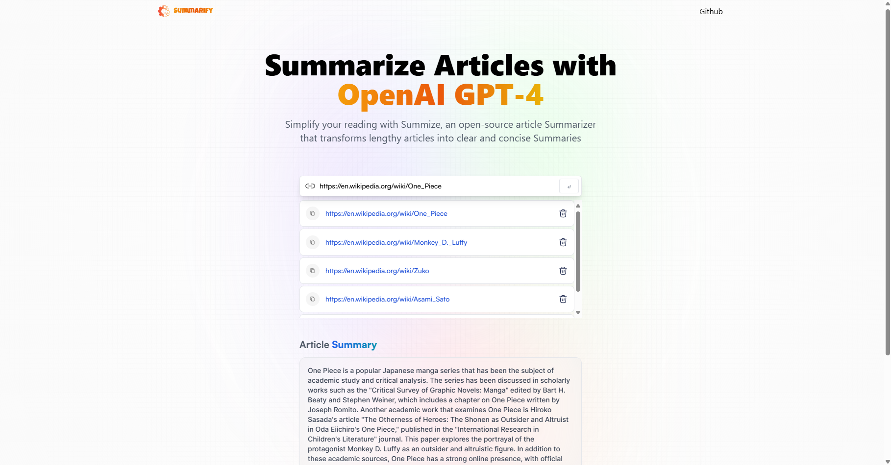

# Summarify
Sebuah website artikel untuk merangkum suatu website artikel yang dapat merangkum isi secara umum webiste artikel tersebut


## Daftar Isi

- [Fitur](#fitur)
- [Dokumentasi Halaman](#dokumentasi-halaman)
- [Cara Instalasi](#cara-instalasi)
- [Cara Penggunaan](#cara-penggunaan)
- [Kontribusi](#kontribusi)
- [Lisensi](#lisensi)
- [Kontak](#kontak)

## Fitur

- Merangkum Website Artikel : Merangkum isi keseluruhan isi website artikel agar menghemat waktu dengan tahu isinya secara umum.
- Menampilkan Hisotri Pencarian : Menampilkan histori pencarian agar dapat melihat kembali isi webiste yang telah dicari
- Menghapus Histori Pencarian : Menghapus histori pencarian agar dapat melihat histori yang diinginkan saja

## Dokumentasi Halaman


## Cara Instalasi

Instruksi langkah demi langkah untuk menginstal proyek Anda secara lokal.

```bash
# Clone repository ini
git clone https://github.com/username/repository-name.git

# Masuk ke direktori proyek
cd repository-name

# Instal dependensi
npm install

```

## Cara Penggunaan
1. Cari website artikel dengan contoh link url ini ```https://en.wikipedia.org/wiki/Avatar:_The_Last_Airbender```
2. Paste url tersebut ke kolom pencarian
3. Hasil akan tampil di kolom histoti

# Jalankan server kodenya secara live
npm run dev --watch
